# HYROX 訓練與競賽應用系統 - 功能說明與現場操作手冊 (System Operation Manual)

> **文件版本**：v1.0 (Build 2026.09)  
> **系統架構**：100% 離線優先 (Offline-First) · 零外部網路依賴  
> **PDF 下載**：[下載完整排版 PDF 操作手冊](docs/system-operation-manual.pdf)  
> **HTML 檢視**：[線上/本機瀏覽器開啟 HTML 版本](docs/system-operation-manual.html)  

---

## 目錄 (Table of Contents)

1. [系統架構與設計核心概念](#01-系統架構與設計核心概念)
2. [大螢幕投影即時監控系統 (/live)](#02-大螢幕投影即時監控系統-live)
3. [教練端課表管理與課堂控制 (/workout)](#03-教練端課表管理與課堂控制-workout)
4. [選手自助手環報到系統 (/checkin)](#04-選手自助手環報到系統-checkin)
5. [選手成績單與社群分享卡 (/result & /leaderboard)](#05-選手成績單與社群分享卡-result--leaderboard)
6. [選手線上預約報名系統 (/signup)](#06-選手線上預約報名系統-signup)
7. [場館設定與安全管理系統 (/settings)](#07-場館設定與安全管理系統-settings)
8. [賽務異常改判與手動補錄 (Exceptions & Reinterpretation)](#08-賽務異常改判與手動補錄-exceptions--reinterpretation)
9. [快捷鍵速查與現場緊急排障指南](#09-快捷鍵速查與現場緊急排障指南)

---

## 01 系統架構與設計核心概念

### 1.1 100% 離線優先架構 (Offline-First)
HYROX 訓練與競賽應用系統專為現場高強度體能賽事量身打造，具備極致的強韌性與零外部依賴：
* **零外部 CDN / 雲端依賴**：所有前端 HTML/CSS/JS、字型（JetBrains Mono 等）、圖示均由本地 Hub 主機直接供應。即便展覽館或地下室體育場發生外網完全斷線，現場賽事計時與投影監控絲毫不受影響。
* **嵌入式高可靠 SQLite 引擎**：採用 Write-Ahead Logging (WAL) 模式，寫入即時落盤（`fsync`），確保主機遭遇突發斷電重啟後，100% 復原選手已完賽數據。

### 1.2 事件回溯 (Event Sourcing) 與時間軸重建
系統底層嚴格遵循不可變（Immutable）日誌架構。選手於每一道感應門的刷卡訊號均記錄為原始事件（Raw Event）。選手的目前分站、耗時、完賽狀態均由狀態機重播衍生。若賽事裁判針對特定漏讀進行手動「改判（Reinterpret）」，系統能無損重新推導整體歷史成績，並在審計日誌（Audit Log）完整記載操作者與原因。

### 1.3 核心角色與端點設備劃分
| 端點角色 | 推薦硬體設備 | 訪問路徑 | 核心職責 |
| :--- | :--- | :--- | :--- |
| **大螢幕投影** | 4K/2K 投影機、電視牆、大尺寸電視 | `/live` | 全場選手進度即時可視化、多頁輪播、完賽頒獎台 |
| **教練操控端** | iPad / Android 平板電腦、筆記型電腦 | `/workout` | 課表編輯調序、課堂生命週期控制、選手狀態監控 |
| **選手報到亭** | 觸控平板 + 桌面型 RFID 感應器 | `/checkin` | 選手自助手環感應綁定、號碼布核發、聲響確認 |
| **場館後台管理** | 場館工作站、主控電腦 | `/settings` | 場館 PIN 碼保護、讀卡機 RSSI 監控、系統備份關機 |
| **選手成績查詢** | 選手個人手機（掃描 QR Code） | `/result` | 分站成績檢視、一鍵生成 9:16 IG 限動卡片、社群分享 |

---

## 02 大螢幕投影即時監控系統 (/live)

大螢幕視圖（`/live`）專為運動員在極度疲累狀態下遠距離辨識所設計，採用 2560x1440 向量縮放佈局，無論在任何投影解析度下皆能精準對齊。

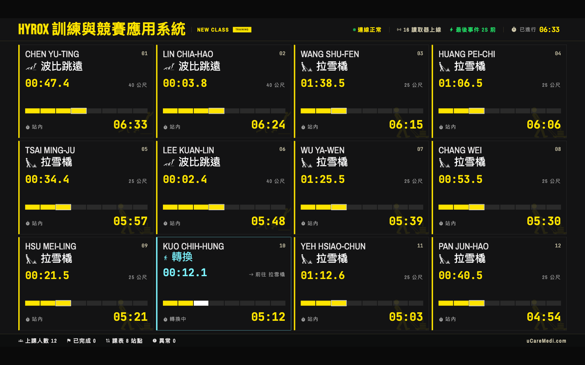

### 2.1 頁面分區與資訊識別
* **頂部狀態列 (Telemetry Header)**：顯示系統連線狀態（綠燈正常/紅燈離線）、線上讀卡機總數、最後感應事件時間、課堂累計進行時間（Class Elapsed）以及當前輪播頁碼（如 1/2）。
* **平滑輪播進度條 (Page Progress Bar)**：位於螢幕最頂端的金黃色進度條，倒數秒數與後台 `live_page_ms`（如 15 秒）連動，提供視覺預期畫面何時翻頁。
* **選手卡片矩陣 (Athlete Grid)**：每個方格代表一位選手，清晰顯示：
  * **BIB 號碼布與姓名**：高對比白字與醒目字號。
  * **8 站環狀進度圖 (Station Progress Ring)**：以色塊標記當前進行分站（黃色閃爍）、已完成分站（綠色）與未完成分站（灰色）。
  * **目前分站與累計總時間**：使用等寬字體（JetBrains Mono）即時計時。
  * **分站歷史細節**：列出 SkiErg、Sled Push、Sled Pull、Burpee 等過往站點的個別耗時與轉場休息時間。
* **底部統計列 (Footer)**：展示全場上課總人數、完賽人數、課表總站數與當前異常件數。

### 2.2 全新頒獎台與排行榜模式 (Podium & Leaderboard View)
當課堂進入尾聲或訓練結束時，可一鍵將大螢幕切換至具有極致榮譽感的「奧運頒獎台」排位視圖：
* **切換方式**：直接按下鍵盤 `L` 鍵，或由 URL 參數進入 `/live?view=podium`，亦可點擊頁尾右下角的「切換排行榜」按鈕。
* **前三名頒獎立體台**：第 1 名（金黃色冠軍台 270px）、第 2 名（銀白色亞軍台 190px）、第 3 名（古銅色季軍台 140px），直觀展示冠亞季軍大字姓名、號碼布、完賽時間與完成站數。
* **第 4 至 12 名排行榜網格**：整齊劃一的 3 欄式即時成績列表，垂直排版舒適不遮擋頂部狀態列。

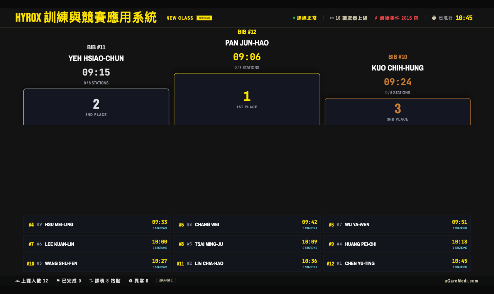

---

## 03 教練端課表管理與課堂控制 (/workout)

教練端（`/workout`）是訓練現場的調度指揮中心。教練可在此建立自訂訓練範本、調派課程、發起計時、監控進行狀態並隨時標記完賽。

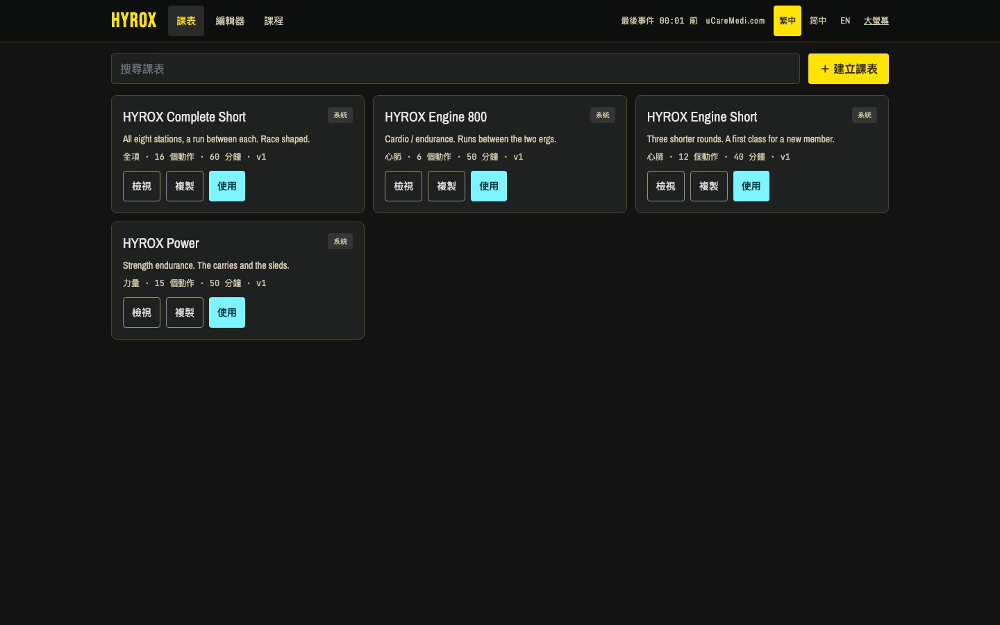

### 3.1 視覺化課表編輯器 (Workout Builder)
為避免教練在訓練場因流汗或手部晃動造成拖曳誤觸，全新 Workout Builder 採用清晰且精準的實體按鈕控制：
* **訓練區塊（Block）快速調序與複製**：
  * `▲` **上移區塊**：將整個訓練單元往上移動一位（首個區塊自動停用防呆）。
  * `▼` **下移區塊**：將整個訓練單元向下移動一位（末個區塊自動停用防呆）。
  * `⎘` **整塊快速複製**：一鍵完整拷貝該區塊內所有的動作項目、預設組數、重量參數與教練註記，大幅提升設計金字塔（Pyramid）或循環課表之效率。
* **動作項目（Exercise）微調**：
  * 每個動作右側皆配置 `▲`、`▼` 排序按鈕，輕觸即可瞬間互換順序。

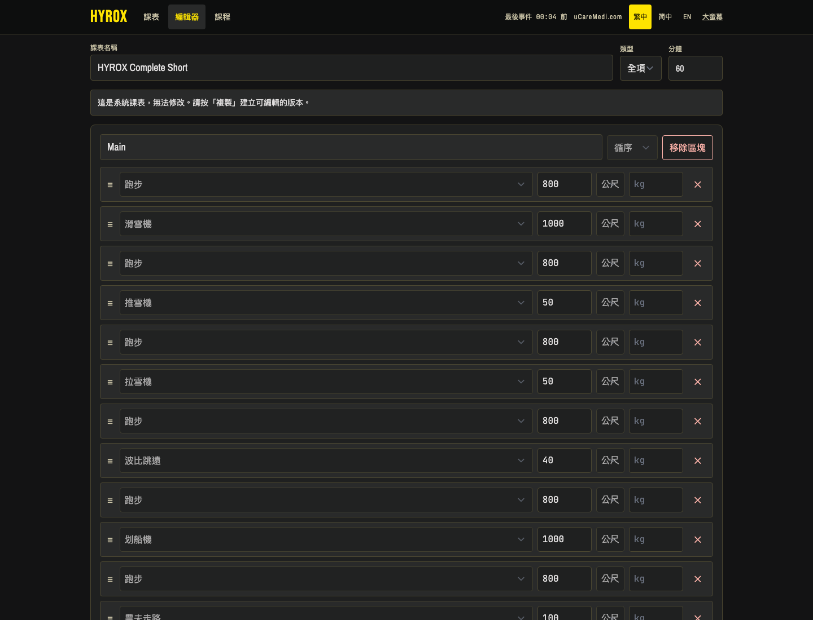
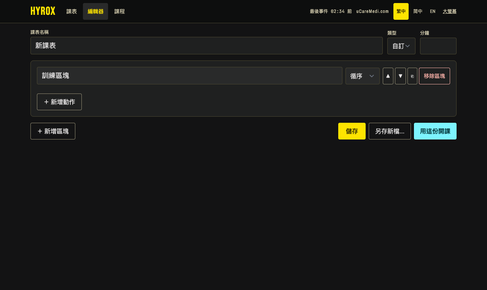

### 3.2 課堂生命週期控制 (Class Lifecycle)
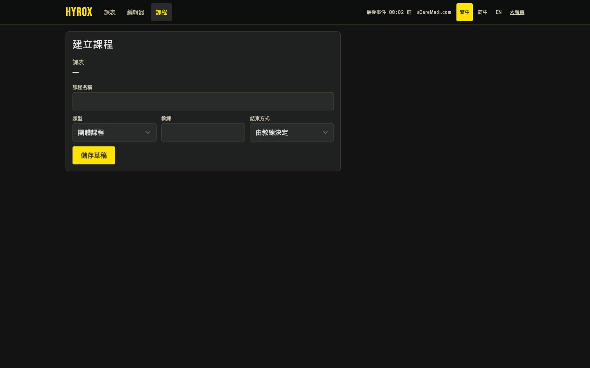
* **Ready (備戰中)**：已指派課表範本，開放選手刷卡報到並綁定手環。
* **In Progress (計時進行中)**：教練按下「Start Class」，主時鐘啟動，大螢幕同步起跑。
* **Paused (暫停)**：突發緊急狀況時可隨時暫停時間，再次按下可原秒數繼續。
* **Finished (結束結算)**：全員完賽或課堂時間到，停止接收進站感應並結算總排名。

---

## 04 選手自助手環報到系統 (/checkin)

選手自助手環報到系統（`/checkin`）提供現場零人力介入的流暢報到體驗，支援手環隨到隨領、快速核發與音效確認。

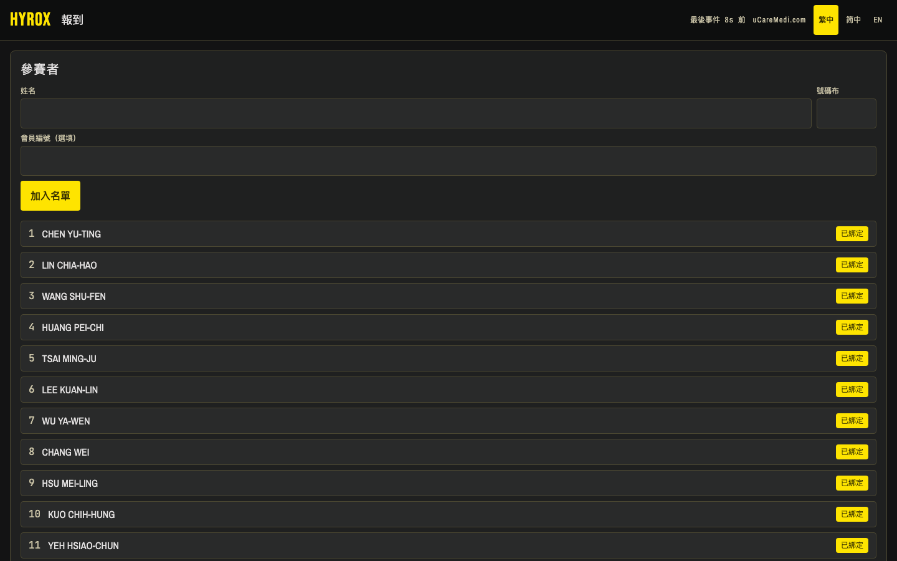

### 4.1 自助報到標準作業流程 (SOP)
1. 選手抵達場館報到亭（平板電腦搭配桌面型 USB/藍牙/乙太網 RFID 讀卡機）。
2. 選手於螢幕名冊中點選自己的姓名，或使用搜尋框輸入姓名/號碼布（BIB）。
3. 從收納盒拿取任一只 HYROX RFID 晶片手環，靠近讀卡機感應區。
4. 系統感應到手環晶片 ID 後立即與該選手綁定，畫面切換為綠色勾選，並伴隨升調音效提示完成。

### 4.2 Web Audio 雙頻合成音效反饋機制
* **感應單音 (Ping)**：頻率 660 Hz 單音蜂鳴（長度 120ms），代表讀卡機已成功捕獲新手環晶片序號。
* **綁定成功 (Success Chime)**：523 Hz 立即升調至 659 Hz（音階 C5 &rarr; E5）雙音歡慶和弦（長度 250ms），代表手環與選手號碼布已成功綁定寫入資料庫。

### 4.3 名冊管理與快速換卡解綁
若選手戴錯手環或手環遺失，工作人員可於此介面點擊「解綁」，晶片即刻釋放回可用手環池，並可立即指派新手環，無須重新建立選手資料。

---

## 05 選手成績單與社群分享卡 (/result & /leaderboard)

完賽後每位選手皆可透過手機瀏覽個人成績單（`/result?bib=...`），並一鍵生成專屬的 9:16 直式限時動態卡片。

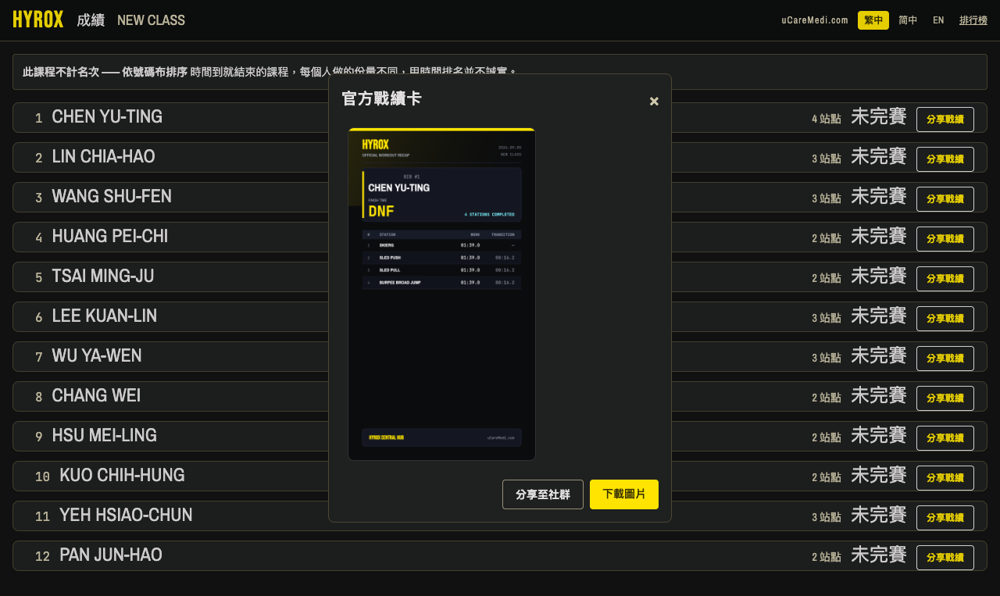

### 5.1 9:16 Instagram Story 限動卡片生成器
* **純前端原生 Canvas 渲染**：零後端算圖負擔、零外部網路依賴，本機直接輸出 1080x1920 超高解析度標準 Instagram / LINE 限時動態格式 PNG。
* **經典 HYROX 運動品牌視覺美學**：
  * 質感碳黑背景（`#0E1017`）搭配金黃核心品牌色（`#FEE400`）。
  * 選手 BIB 號碼布、全名、總排名（如 `RANK #1`）與總完賽時間大字體排版。
  * 完整 8 站各站運動耗時（Split Time）與轉場休息時間（Transition Time）對齊表格。
  * 底部具備官方認證場館浮水印與計時驗證碼。
* **全通路社群分享**：
  * **下載卡片 (Download PNG)**：一鍵將 1080x1920 高清原圖儲存至手機相簿。
  * **原生分享 (Web Share API)**：在行動裝置支援時，點擊直接呼叫 iOS / Android 系統原生分享面板，一鍵直傳 Instagram Stories、Facebook 或 LINE 群組。

### 5.2 場館與課堂排行榜 (/leaderboard)
提供全場選手排名清單，支援分組（男單、女單、雙人組）、年齡層篩選，並以折線圖分析每位選手在不同分站的體能配速差異。

---

## 06 選手線上預約報名系統 (/signup)

提供選手於賽前或課前透過智慧型手機預約登記課堂席次，自動鎖定號碼布與梯次組別。
* **自主名額登記**：選手輸入英文全名、聯絡資訊與參賽組別（如 Pro / Open / Doubles）。
* **自動發配號碼布 (BIB Assignment)**：依據場館設定之號碼區間（例如 #1 ~ #50）自動遞增指派號碼，避免現場號碼衝突。
* **即時同步至報到亭**：線上報名成功之資料毫秒級同步至 `/checkin` 名冊，選手抵達現場即可直接刷卡綁定手環。

---

## 07 場館設定與安全管理系統 (/settings)

場館設定頁面（`/settings`）是掌控硬體射頻參數、顯示偏好與資料安全的核心後台，全域受到純數字安全鎖保護。

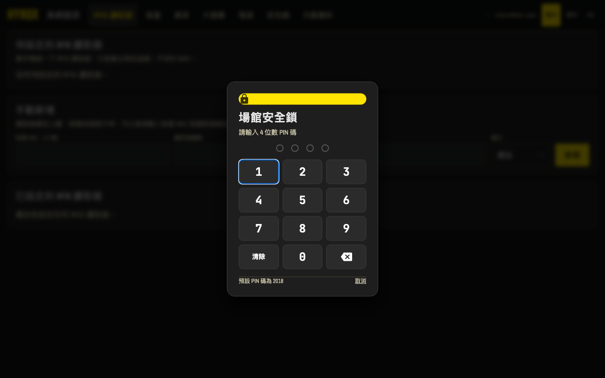
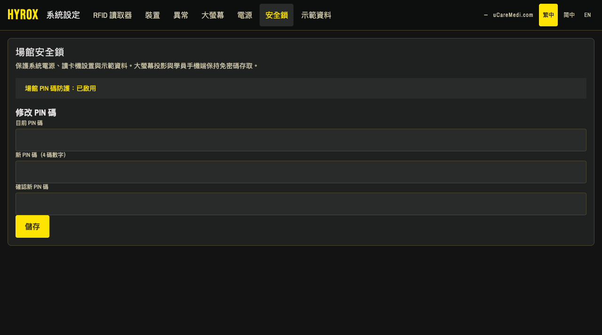

### 7.1 場館 4 位純數字 PIN 安全鎖 (Venue PIN Lock)
* **設計初衷**：防止公用平板在非執教期間遭學員或無關人員誤觸重啟讀卡機或竄改賽制。
* **系統預設值**：出廠預設為 `2018`（HYROX 誕生年份）。
* **操作特性**：
  * 支援實體鍵盤 0~9 輸入與螢幕觸控 9 宮格按鈕，輸入滿 4 碼立即自動發送驗證。
  * 密碼錯誤具備即時紅色抖動警示；驗證通過後由瀏覽器記住憑證 12 小時，當日值班免重複輸入。
  * 審計保護：日誌（Logs & Audit）絕不記錄密碼明文，統一以 `****` 遮罩。

### 7.2 讀卡機管理與 4 格動態 RSSI 訊號指示條
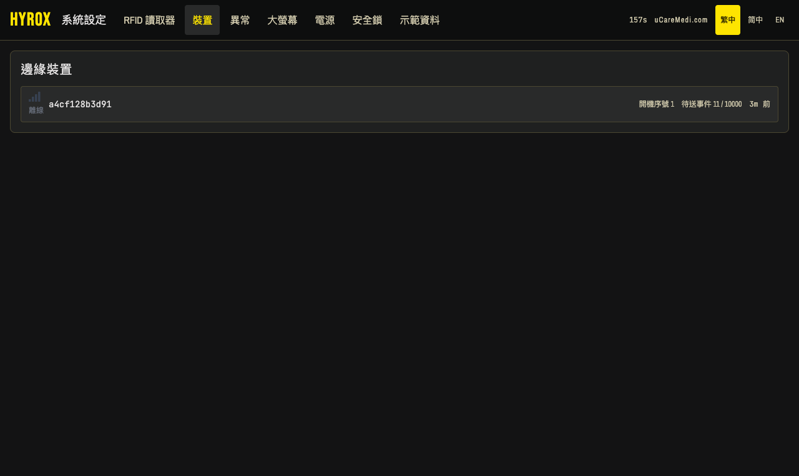

| 訊號格數 | 顏色狀態 | RSSI 範圍 / 判斷標準 | 現場維運建議 |
| :--- | :--- | :--- | :--- |
| **4 格全滿** | 綠色 | > -65 dBm (且 10 秒內有心跳) | 通訊極佳，射頻天線覆蓋理想。 |
| **3 格** | 淺綠/黃 | -65 dBm ~ -75 dBm | 通訊良好，正常運作中。 |
| **2 格** | 黃色 | -75 dBm ~ -85 dBm | 邊緣訊號，建議檢查天線是否有金屬障礙物遮擋。 |
| **1 格** | 紅色 | < -85 dBm 或接收異常 | 訊號極弱，恐有漏讀風險，需調近讀卡機距離。 |
| **0 格 (灰底)** | 灰色 | 超過 60 秒無心跳 (離線) | 設備已斷電或網路中斷，請重啟設備電源。 |

### 7.3 大螢幕客製化與場館 Logo
後台可自訂輪播秒數（預設 15 秒）、方格版型（如 2x4、3x4 或 4x4 矩陣），並可直接上傳健身房專屬 Logo，上傳後大螢幕即刻更新顯示，無需手動重新整理螢幕。

---

## 08 賽務異常改判與手動補錄 (Exceptions & Reinterpretation)

在激烈賽事中，選手可能發生手環鬆脫、遺漏進入轉場通道或誤觸相鄰感應門等狀況。本系統完整實作 ADR 0001 D4 規範，提供完整的裁判處置手段。

### 8.1 感應異常類型識別
* `UnknownTag`：讀卡機感應到未在名冊中的手環（例如旁觀學員誤觸感應門）。
* `UnknownReader`：收到未於後台綁定站點名稱的未知天線封包。
* `MissingTransition`：選手尚未完成前一站即跳站刷卡。
* `DuplicateRead`：同一選手於短時間內連續觸發同站門禁。

### 8.2 裁判三大處置機制
| 處置動作 | API 端點 | 作用與使用情境 |
| :--- | :--- | :--- |
| **直接採納 (Accept)** | `POST .../accept` | 將異常視為有效事件直接併入計時。適用於名冊延遲匯入但選手已出發之情境。 |
| **作廢剔除 (Void)** | `POST .../void` | 將該筆誤讀記錄作廢移出收件匣。適用於路人誤觸或重複刷卡。 |
| **重新改判 (Reinterpret)** | `POST .../reinterpret` | **全功能賽務補錄**： • 可重新指派給正確選手 ID（解決戴錯手環）。 • 可手動修正站點編號（Station）與進出模式（Entry / Exit）。 • 系統自動作廢原異常、提交新解讀，並**重算選手全部分段時間與成績**。 |

> **防弊審計規範 (CLAUDE.md #20)**  
> 執行 `Reinterpret` 或 `Void` 時，必須於 HTTP 標頭提供裁判識別碼 `x-operator-device`，且請求本體必須提供明確修改原因（`reason`，不可為空）。所有處置紀錄均寫入不可竄改的 Audit 日誌，保障賽事公信力。

---

## 09 快捷鍵速查與現場緊急排障指南

### 9.1 系統重要 URL 與用途速查表
| 網址路徑 | 用途說明 | 建議預設瀏覽器縮放 |
| :--- | :--- | :--- |
| `/live` | 大螢幕多頁輪播監控 | 100% (系統內部自動向量自適應) |
| `/live?view=podium` | 大螢幕全螢幕頒獎台模式 | 100% (按鍵盤 `L` 隨時切換) |
| `/workout` | 教練課表編輯與開課控制 | 100% (平板觸控友善) |
| `/checkin` | 選手自助手環報到亭 | 100% (建議全螢幕 Kiosk 模式) |
| `/result` | 選手個人成績與 IG Story 分享 | 手機直向瀏覽 |
| `/settings` | 場館設定與設備訊號監控 | 需要 PIN 碼解鎖 (預設 2018) |

### 9.2 常用快捷鍵對照表
| 快捷鍵 | 作用畫面 | 功能描述 |
| :--- | :--- | :--- |
| `L` / `l` | 大螢幕視圖 (`/live`) | 於「方格矩陣監控」與「頒獎台 (Podium)」之間秒級雙向切換。 |
| `Esc` | 所有頁面彈窗 | 關閉當前開啟的彈窗（如 PIN 碼鎖定、分享預覽卡等）。 |
| `0` ~ `9` | 場館設定 (`/settings`) | 直接以鍵盤輸入 4 碼 PIN 碼快速解鎖。 |
| `Backspace` | 場館設定 (`/settings`) | 倒退刪除一位已輸入的 PIN 碼。 |

### 9.3 現場常見故障緊急排查 (Troubleshooting)
* **Q1：大螢幕頂部出現紅燈並顯示「連線中斷，正在重新連接...」？**  
  **解答**：系統具備自動重連機制（WebSocket Auto-Reconnect），每 1 秒自動嘗試重連一次。請檢查大螢幕主機與 Hub Server 之間的區域網路連線或 Wi-Fi 訊號。連線恢復時頂部將自動滑出綠色提示並淡出。
* **Q2：讀卡機訊號呈現 1 格紅色或斷線灰色？**  
  **解答**：進入 `/settings` 檢視該讀卡機的「最後事件（Age）」。若超過 60 秒無心跳，請檢查讀卡機供電線與乙太網線是否鬆脫。若是無線讀卡機，請調整天線仰角以避開現場大型金屬深蹲架或槓片架。
* **Q3：現場忘記場館 PIN 碼，無法進入 /settings 解鎖？**  
  **解答**：系統提供伺服器層級的安全覆蓋機制，可透過下列任一方式重設：  
  1. **環境變數強制覆蓋**：重啟 Hub 服務時帶入 `HYROX_PIN=2018 ./hub-server`，即可將密碼強制還原為預設值。  
  2. **SQLite 指令重設**：執行指令 `sqlite3 hyrox.db "UPDATE settings SET value='2018' WHERE key='venue_pin';"` 即可完成解鎖。
