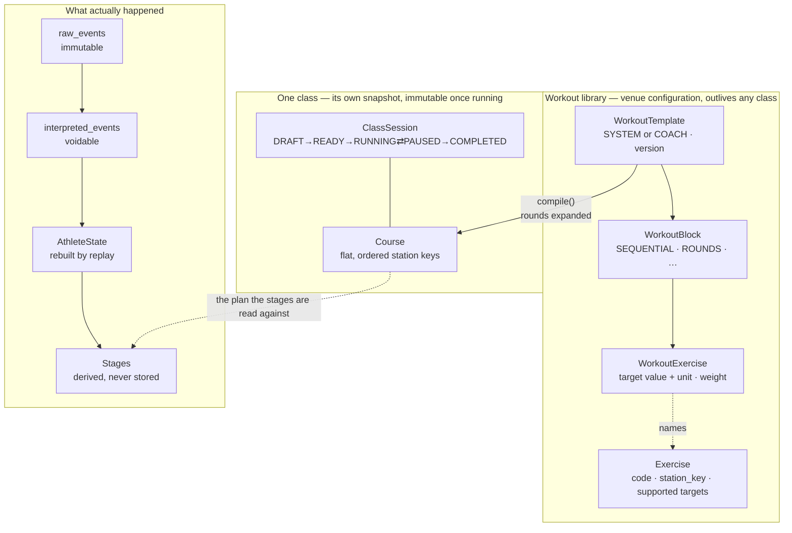
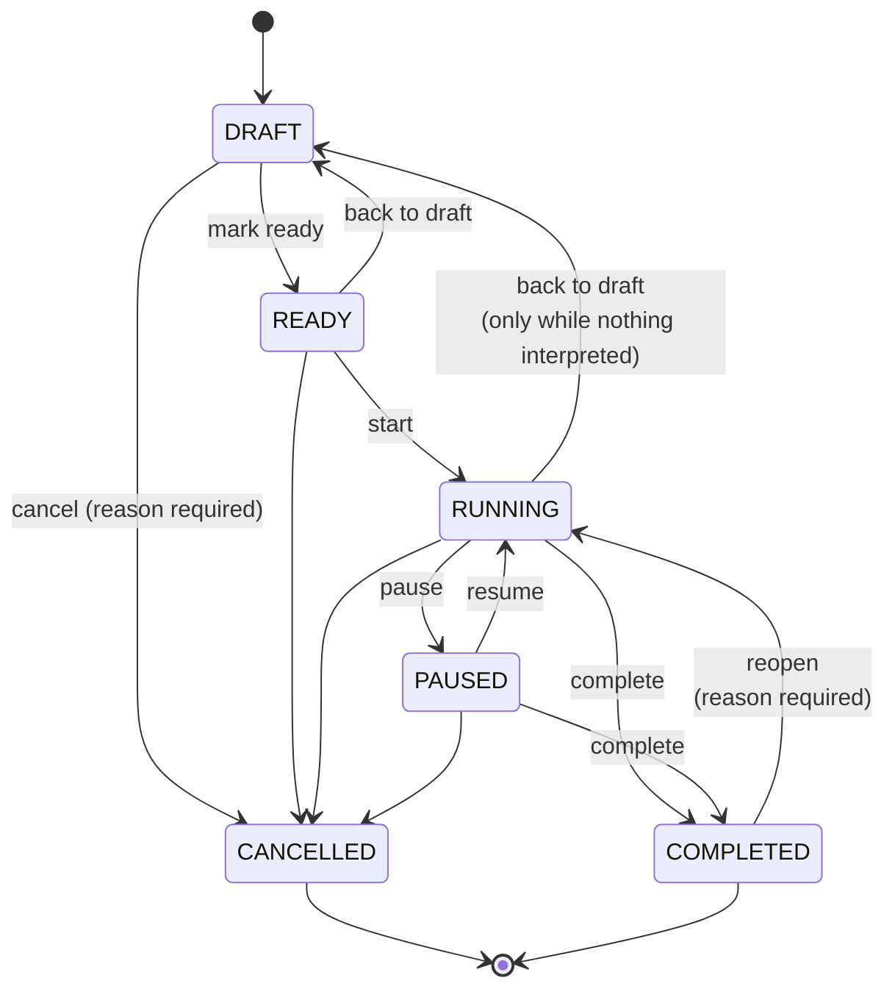
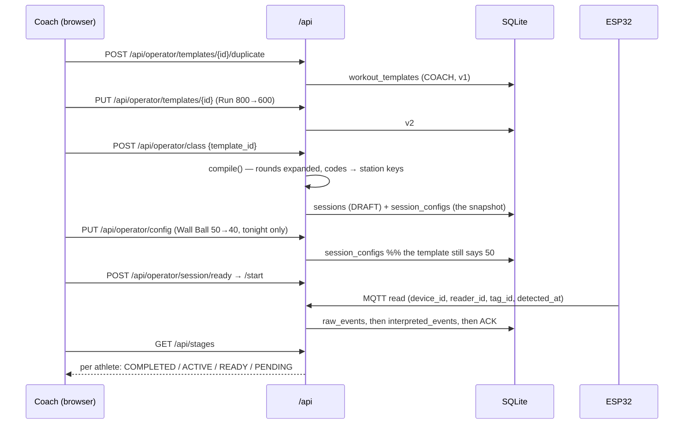

# Workout templates and class sessions

How a coach's plan becomes a timed class. Design rationale:
[ADR 0008](decisions/0008-workout-templates-compile-to-course.md).

---

## 1. The shape of it



The one rule that carries the whole design:

> **A running class never reads a template.** Creating a class compiles the template into a
> flat `Course` and snapshots it onto the session. Editing the template afterwards changes
> nothing about a class that already happened.

---

## 2. Exercise

What the athlete does. Nine are seeded on first run (`ExerciseLibrary::preset`).

| Field | Means |
| --- | --- |
| `code` | what a template refers to — `WALL_BALL` |
| `display_name` | what a coach reads — "Wall Ball" |
| `station_key` | **the string a course step and a reader registration both carry** — `WALL BALLS` |
| `category` | `RUN` / `ERG` / `FUNCTIONAL` / `OTHER` |
| `supported_target_types` | which of `DISTANCE` / `REPS` / `TIME` / `CALORIES` are legal |

`station_key` is not the code, on purpose. The venue's readers are registered against
`"ROWING"` and the live screen slugs that same string into its pictogram. An exercise
vocabulary arriving later must not silently unmap either.

### Units

Targets are never strings. `"800m"` cannot be compared, converted or summed.

```text
value + unit      →  canonical
800  + METER      →  800   metres
1    + KILOMETER  →  1000  metres
3    + MINUTE     →  180   seconds
50   + REPS       →  50    reps
```

Canonical units are **metres, seconds, reps, calories**; weight is held in **grams** with the
coach's unit kept beside it, so 2.5 kg and 20 lb are both exact.

Each unit belongs to exactly one target type, and `Target::new` takes the `&Exercise`. So
`RUN + REPS` and `WALL_BALL + DISTANCE` are not merely discouraged — they cannot be
constructed. The builder screen narrows its unit dropdown from the same list.

---

## 3. Template, block, exercise

```text
WorkoutTemplate  "HYROX Engine Short"  ENGINE  COACH  v3
└── WorkoutBlock  "Main"  ROUNDS ×3
    ├── WorkoutExercise  RUN        400 METER
    ├── WorkoutExercise  SKIERG     500 METER
    ├── WorkoutExercise  ROWERG     500 METER
    └── WorkoutExercise  WALL_BALL   20 REPS
```

Ordering is the position in the list — a `Vec` cannot hold two items at position 3 or skip
position 2, so the invariant is structural rather than a column a later write could violate.

**`source`** is `SYSTEM` or `COACH`. A system template is read-only; a coach who wants one
changed duplicates it. The *stored* row decides, never the request payload — otherwise the
rule is bypassed by sending `"source": "COACH"`.

**`version`** advances on every save. A class records the version it was built from, so
"which plan did Friday's class actually run?" stays answerable after the template moves on.

### Block types

| Type | Compiles? | Note |
| --- | --- | --- |
| `SEQUENTIAL` | yes | the exercises once |
| `ROUNDS` | yes | the exercises `rounds` times |
| `INTERVAL` | yes | same expansion; the rest period is a label |
| `AMRAP` | **no** | how many rounds an athlete gets is the result, not the plan |
| `ZONE_ROTATION` | **no** | the rotation order is per athlete, not per course |

The last two are storable and refused at compile time by name
(`CompileError::BlockTypeNotRunnable`), rather than guessed at (CLAUDE.md 28).

---

## 4. Compiling

```text
ROUNDS ×3 [ RUN 400m, SKIERG 500m ]
        │
        ▼  compile(&library)
Course [ RUN, SKIERG, RUN, SKIERG, RUN, SKIERG ]   ← six steps, station keys, canonical targets
```

This is the seam. Below it, the timing engine sees exactly what it always saw.

Refusals: `Empty`, `UnknownExercise`, `RoundsMissing`, `BlockTypeNotRunnable`. All 422 over
HTTP as `TEMPLATE_NOT_RUNNABLE` — the request is fine, the plan is not walkable.

---

## 5. Class session



| State | Accepts reads? | Plan editable? |
| --- | --- | --- |
| `DRAFT` | no | yes |
| `READY` | no | **yes** — this is where tonight's tweak happens |
| `RUNNING` | **yes** | no |
| `PAUSED` | no | no |
| `COMPLETED` / `CANCELLED` | no | no |

`DRAFT → RUNNING` in one step is refused: a class nobody marked ready has not been looked at.
`COMPLETED → RUNNING` is refused by `start` and allowed by `reopen`, which insists on a
reason — ADR 0001 D2's mis-tap case, kept, as a correction rather than a transition.
`CANCELLED` is never reopened.

### The class clock and PAUSE

A paused class is not timing anybody, so paused wall time is not class time.

```text
elapsed(now) = (now − started_at) − paused_total − (now − paused_since, if paused)
```

A `ClassDuration` finish rule resolves to `started_at + limit + paused_total`: still an exact
instant, still the moment the rule fired and not the moment a tick noticed (CLAUDE.md 11, 17).
`paused_total_ms` and `paused_since` are columns on `sessions`, so a hub that restarts
mid-pause comes back paused rather than handing the class back the time it stood still.

---

## 6. Athlete session and stages

Derived on read, stored nowhere.

```text
snapshot Course  ×  AthleteState.runs (replayed)  →  Vec<StageView>
```

| Status | When |
| --- | --- |
| `PENDING` | further down the plan |
| `READY` | the next thing to do — one at a time, only while the athlete is between stations |
| `ACTIVE` | inside this station now |
| `COMPLETED` | entered and exited |
| `SKIPPED` | stepped over; the athlete went on to a later station |
| `DNF` | the class ended before they reached it, or with them still inside |

Storing stage rows would create a second source of truth that voiding an interpretation
would not update. Deriving them means a correction changes the stage list for free
(CLAUDE.md 20, 21).

---

## 7. RFID integration

The edge is untouched. Presence / re-arm suppression stays on the ESP32 exactly as
`docs/event-protocol.md` §14 describes; no workout logic goes near it.

```text
ESP32  ──MQTT──>  ingest_read  ──>  raw_events (immutable)
                       │
                       ├──> reader registry: (device_id, reader_id) → station_key
                       ├──> binding ledger:  tag → athlete
                       └──> domain::decide  → Entered / Exited / Exception
                                                     │
                                                     ▼
                                          interpreted_events → replay → AthleteState
```

An exercise is not a station (§2). A venue with three rowers registers three readers, all
carrying `station_key = "ROWING"`; `domain::StationMap` records which machine serves which
exercise for the screens that need to name `ROW_02`.

### Expectation

`domain::expectation(course, athlete, station)` compares where the athlete arrived with where
the plan expects them:

| Answer | Means |
| --- | --- |
| `EXPECTED` | the station the plan calls for next |
| `OUT_OF_ORDER` | in the plan, but not at this point in it |
| `UNEXPECTED` | not in the plan at all |
| `UNKNOWN` | there is no plan — a drop-in class. Not the same as "wrong" |

`/api/stages` reports it per athlete as `expectation`, for the station they are standing in
(`null` between stations).

**It gates nothing.** Training records what happens and must not warn on a different order
(CLAUDE.md 9.2); the competition exception rules are undecided (CLAUDE.md 28). Nobody is
disqualified by this — it is a label for a screen and for a rule engine that does not exist
yet.

---

## 8. Data flow, end to end



---

## 9. Storage

| Table | Holds |
| --- | --- |
| `exercises` | the library; `supported_target_types` as a JSON array |
| `workout_templates` | one row per template, blocks as a JSON document |
| `stations` | physical machines and the exercise each can serve |
| `sessions` | + `paused_total_ms`, `paused_since`, `template_id`, `template_version`, `coach_id`, `scheduled_at` |

Blocks are one JSON document per row for the same reason the session snapshot is
(migration 0003): a nested, ordered structure the hub reads whole and writes whole.
Normalising it would buy joins nobody performs.

**Migration 0004 rebuilds `sessions` and its three child tables** to widen the status CHECK.
`sqlx` runs migrations in a transaction where `PRAGMA foreign_keys=OFF` is ignored, so
create-copy-drop is refused on any database that already holds events; the rename-first form
is used instead. `crates/storage/tests/migration_0004.rs` reconstructs a pre-0004 database
and asserts row counts, interpreted-event ids, and `PRAGMA foreign_key_check`.

`raw_events` is not touched by any of this.

---

## 10. API

Reads on the read-only surface, writes under `/api/operator` — the split is structural
(ADR 0007 §5). Full table in [docs/api.md](api.md).

```text
GET    /api/exercises
GET    /api/workout-templates
GET    /api/workout-templates/{id}
GET    /api/stages

POST   /api/operator/templates                    ✎
PUT    /api/operator/templates/{id}               ✎
DELETE /api/operator/templates/{id}               ✎!  reason required
POST   /api/operator/templates/{id}/duplicate     ✎
POST   /api/operator/class                        ✎

POST   /api/operator/session/{ready|start|pause|resume|complete}   ✎
POST   /api/operator/session/cancel                               ✎!
```

---

## 11. Screens

`/workout` — one static page, no build step, served like `/live`.

* **Workouts** — system and coach templates, search, duplicate, edit, delete, use.
* **Builder** — drag to reorder, add/remove exercises and blocks, change target, unit,
  weight and rounds. Unit dropdowns are narrowed to what the chosen exercise supports, so an
  illegal combination cannot be typed. A system template opens read-only with every control
  disabled.
* **Class** — create from a template, adjust tonight's targets, then
  Ready / Start / Pause / Resume / Complete / Cancel.

Every write carries `x-operator-device`; the page asks for the device name once and keeps it
in local storage (ADR 0001 D1).

**Languages.** Both screens read their labels from `apps/hub-server/static/i18n.js`, served
locally at `/i18n.js` — Traditional Chinese, Simplified Chinese, English. Exercise names are
translated by `Exercise.code`; `station_key` never is, because it is an identifier the reader
map and the pictograms both depend on. `apps/hub-server/tests/i18n.rs` asserts the three
dictionaries stay in step and that no station key is ever used as a translation key.

---

## 12. Open

* **AMRAP and zone rotation have no execution model.** Storable, not runnable. Deciding what
  "finished" means for an AMRAP is a product question.
* **Nothing consumes `Expectation` yet.** It is derived and published; the rule engine that
  would act on it waits on the competition exception rules (CLAUDE.md 28).
* **Time and calorie targets are labels.** RFID reports entry and exit and nothing about what
  happened on the machine. Verifying them needs the sensor adapters of the brief's §23.
* **One active class at a time.** Creating a class while one is RUNNING or PAUSED is refused.
  Scheduling several classes a day needs a session list, which nothing asks for yet.
